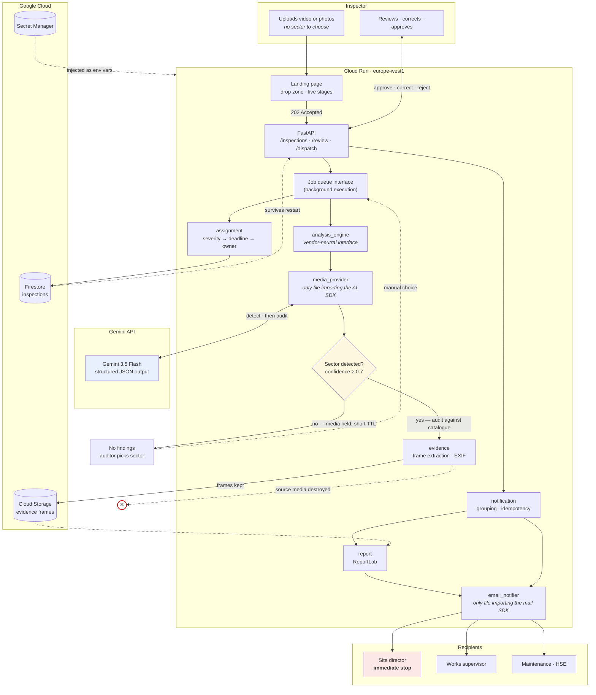

# Architecture

## Flow



## The one rule that shapes everything

**Every external dependency has exactly one implementation file, behind a
neutral interface.**

| Interface | Implementations | Swappable without touching callers |
|---|---|---|
| `analysis_engine.analyze()` | `providers/media_provider.py` | Yes |
| `storage.save/path/delete` | local filesystem, Cloud Storage | Yes |
| `inspection_store.get/set/update` | memory, Firestore | Yes |
| `job_queue.dispatch()` | background tasks, real queue later | Yes |
| `email_notifier.send()` | transactional email API | Yes |

No module outside those files imports a vendor SDK or names a vendor. This was
enforced from the first commit, not retrofitted — which is why replacing the
in-memory store with Firestore touched one file plus ten mechanical `await`s,
and why adding Cloud Storage did not touch the PDF generator or the email
builder.

## Why sector detection has a refusal path

The obvious design detects the sector and audits against whatever it picked.
That design cannot fail visibly — it always produces findings, including on a
scene it misread. For a safety tool, findings produced against the wrong
catalogue are worse than no findings: they look authoritative and they are
wrong.

So detection has an explicit "I don't know" outcome. Below 0.7 confidence, or on
a scene matching no catalogue, the agent audits nothing and hands the decision
back to the auditor. The same discipline governs individual findings: below 0.7
a finding is flagged `a_verifier` rather than asserted as a non-conformity.

## Why asynchronous

An inspection takes 15–40 seconds. Blocking the request would tie the inspector
to a browser tab and make the mobile experience unusable on a site with poor
connectivity. `POST /inspections` returns `202` immediately; the inspector can
close the tab and come back — or simply wait for the notification.

This is also what makes the system an agent rather than a service: the work
continues without the human present.

The landing page reports real progress. The job writes a `stage` field that
`GET /inspections/{id}` exposes, and the UI is driven from it. Stages that
happen inside a single model call are shown as active together rather than
animated in sequence — the display never claims a step is complete when the
backend cannot confirm it.

## Failure handling

- `/health` never touches Firestore or Cloud Storage, so a downstream outage
  never causes Cloud Run to restart a healthy container.
- Backend failures surface as `503` with a readable cause, not a bare stack
  trace. Upstream model unavailability produces a failed inspection with a
  retry action, never a crash or partial state.
- Startup logs which backends are active. If a backend is unreachable the app
  still starts and says so, bounded at 5 seconds — it does not hang.
- Dispatch is idempotent: a finding already sent is never sent twice, even on a
  double click. Partial failure never rolls back successful sends.
- Every secret is stripped of surrounding whitespace at read time, and any
  exception message is scanned for secret values and redacted before being
  logged or returned — including inside tracebacks, where message-level
  redaction alone would not reach.

## Data lifecycle

```
upload → detection ─┬─ sector found → audit → evidence frames extracted
                    │                        → source media deleted
                    │                        → frames to Cloud Storage
                    │                        → findings to Firestore
                    │
                    └─ sector unknown → no findings
                                      → media held, short TTL
                                      → deleted on any audit, or on expiry
```

Source video and photos are destroyed once their audit is done, both locally and
at the provider. Only what documents an actual finding is kept. This is a
product decision before it is a technical one: it removes most of the privacy
objection a works council would raise, and it keeps storage cost proportional to
findings rather than to footage.

## Configuration over code

Rule catalogues (`app/rules/*.yaml`), role assignments
(`app/rules/responsables.yaml`) and the analysis prompt
(`app/prompts/inspection.txt`) are editable files, not code. Sector labels and
descriptions shown in the interface come from those same YAML files. An HSE
professional can adapt the system to their own risk assessment without a
developer — which is the only way this scales beyond two sectors.
